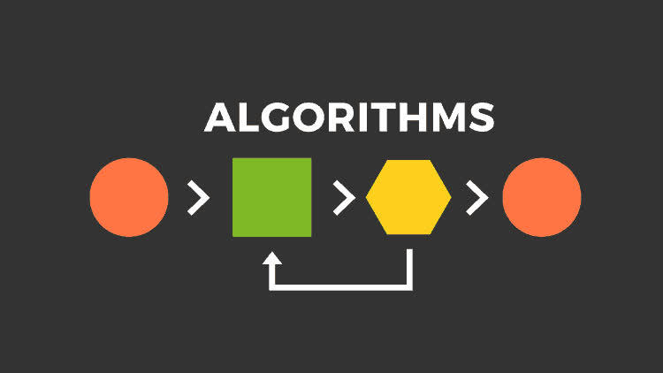

# Algorithms.

## Introduction.

Algorithms refer to the set of instructions used to solve a particular problem or perform a specific task.
This section is further divided into.

- [Sorting and searching](./search_sort/index.md)
- [Greedy algorithms](./greedy/index.md)
- [Dynamic programming](./dynamic/index.md)
